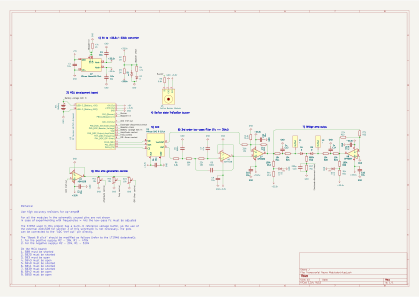

# Transcranial Neuromodulator

"Transcranial Neuromodulator" is an experimental open-hardware project aimed at alleviating insomnia, lack of deep sleep, anxiety, and potentially other parasomnia disorders. 

## ⚠️ Warning and Liability Agreement

**The device described here can be EXTREMELY dangerous.** Because no formal clinical research has been conducted on its specific configuration, parameters, or long-term consequences, replicating or using this device means you explicitly agree to the following terms:

1. You are of legal age to build and operate experimental electronics in your jurisdiction.

2. You possess sufficient engineering and technical knowledge to fully understand the risks of passing electrical currents through the human body.

3. You accept sole and absolute responsibility for constructing, testing, and using this device.

4. This repository is intended strictly as a platform for theoretical research and software/hardware evaluation. I do not urge, encourage, or recommend anyone to use this device on a living subject.

5. I bear no liability or responsibility for any physiological damage, injury, or hardware failure that the use of this device may cause.

## Project Status

The device is currently in its earliest prototyping stage (constructed on a solderless breadboard), though it is fully functional. 

## Rationale

Twenty-eight years ago, I suffered an accident resulting in a severe concussion. While the initial recovery went smoothly, I later completely lost the ability to enter the deep, non-REM sleep stage, and my overall sleep duration plummeted. Last year, the condition deteriorated to the point where I could not remain asleep for more than an hour at a time, with that single hour fractured by multiple micro-arousals. This device was built as a desperate attempt to engineer a solution. In my specific case, it works.

## Principle of Operation

The device passes a pure, low-frequency ($0.25\text{ Hz to }4\text{ Hz}$) sinusoidal alternating current (AC) through the brain via cranial electrodes positioned behind the ears.

While I do not offer a peer-reviewed scientific explanation for its efficacy, I have formulated two primary working hypotheses based on its operation:

* **A) Vestibular Modulation:** The device only seems to be effective when the electrodes are configured as "ear-hooks" placed directly behind and around the ears. This placement likely modulates vestibular system activity, simulating a physical "rocking" sensation. This slow, artificial rocking may trigger an ancient evolutionary instinct akin to a mother rocking an infant to calm the nervous system.

* **B) Entrainment of Subcortical Structures:** The alternating current may modulate subcortical brain areas, gently imposing a delta-rhythm (the dominant waveform characteristic of deep non-REM sleep) on neural networks, thereby making it easier for the brain to sustain deep sleep architecture.

## Personally Observed Effects

Prior to using the device, I was limited to $1\text{ to }1.5\text{ hours}$ of highly fragmented sleep per night. I now apply the device immediately upon going to bed every day. I lie down, put the headset on, and fall asleep with it running. Roughly an hour later, I wake up during a natural sleep cycle transition, remove the headset, and immediately fall back asleep. With this routine, I regularly achieve $6\text{ to }7\text{ hours}$ of sleep per night, with only two to three brief awakenings. Because I do not have access to a clinical sleep laboratory, I cannot definitively verify structural changes in my sleep phases.

However, I have documented several distinct phenomena:

1. **The "Sleep Pill" Effect:** The device acts as a potent electronic sedative. I strictly avoid using it at any time other than immediately before a night's sleep. The state it induces must be "slept off"; using the device during the day causes an overwhelming urge to sleep that derails the remaining afternoon.

2. **Extreme Frequency Dependency:** The physiological effects are highly sensitive to the AC frequency configuration:

   * **At 0.3 Hz:** I experience deep calm and a distinct sensation of physical rocking, but sleep onset is paradoxically delayed.

   * **From 1.0 Hz to 2.0 Hz:** Any underlying anxiety completely dissipates within approximately four minutes. Sleep onset occurs rapidly, accompanied by a soothing, gentle rocking sensation.

   * **From 2.6 Hz to tens of Hz:** Phosphenes (perceived blue flashes of light in the eyes) occur due to retinal or optic nerve stimulation.

   * **From 70 Hz to 120 Hz:** A highly distressing sensation manifests, feeling as though an internal drill is boring into the center of the brain.

   * **Above 120 Hz:** No noticeable physiological effects are perceived.

   * *Note: As I am the sole subject of this evaluation, these observations are naturally subjective.*

3. **Restoration of Deep Sleep Architecture:** In childhood, waking up in the middle of the night naturally brought a heavy, disoriented dizziness as the brain struggled to tear itself away from deep slow-wave sleep. During my years of chronic insomnia, waking up after an hour left me instantly alert and "fine" (though utterly exhausted during the day), indicating I was stuck in light sleep phases. Since utilizing the device at sleep onset, middle-of-the-night awakenings have brought back that long-forgotten, heavy childhood dizziness—strongly suggesting a successful return to deep slow-wave sleep.

## Technical Details & Safety Failsafes

The system architecture centers around an STM32 MCU generating a digital sine wave, which is transmitted via an SPI interface to an external 16-bit DAC. 

The DAC outputs both the generated waveform and its own reference voltage to an operational amplifier configured as a third-order active low-pass filter (cut-off frequency = $25\text{ Hz}$). This flows into a Shifter/Bipolar gain stage, allowing the signal to swing cleanly around ground ($0\text{V}$) to a maximum of $+32.5\text{V} / -32.5\text{V}$. 

This bipolar stage is energized by a $5\text{V}$ to $+33.5\text{V} / -33.5\text{V}$ DC-DC boost converter. It connects to a second op-amp configured as a unity-gain inverter, forming a high-voltage bridge-tied load (BTL) amplifying configuration. Each leg of the output features a passive T-shaped low-pass filter ($7.5\text{k}\Omega\text{--}1\mu\text{F}\text{--}7.5\text{k}\Omega$) before reaching the electrodes. *Note: The resistors, plus intrinsic resistance of the electrodes, act as a critical hardware-level current limit to protect the user.*

To ensure systemic safety, the MCU continuously monitors several critical parameters via its ADC channels and the watchdog timer:

1. High-voltage boost converter output rails.

2. Electrode-to-skin contact status (impedance tracking).

3. System battery voltage.

4. MCU core temperature.

5. The structural health of the final low-pass T-filter resistors.

6. Timely triggering of output sine sample generation. 

7. Correspondence between the generated sample and actual DAC output.

8. Proper functioning of system parameter tuning potentiometers.

In the event of a single parameter anomaly, signal generation is instantaneously terminated, and the hardware goes into a safe shutdown mode.

## Circuit Diagram

### Operation Modes

* **Manual Mode:** Allows manual configuration of the target frequency, session auto-off timer, and output amplitude.

* **Automatic Mode:** Executes a pre-programmed, about $1\text{-hour}$ frequency modulation sweep. It initializes at $1.7\text{ Hz}$, transitions through several precise sub-stages down to $0.6\text{ Hz}$, and executes a gradual amplitude fade-out at termination (see implementation details in `TIMER.c`). Amplitude remains the sole manual override in this mode.

## Main Hardware Components

* **MCU Board:** ST Nucleo-U575ZI-Q (STM32U5 Series)

* **Power Supply:** Mikroe "Boost 8 click" power converter (LT1945)

* **Digital-to-Analog:** Mikroe "DAC 9 click" (TI DAC80501)

* **Amplification:** 2x OPA596 (High-Voltage Op-Amps), 2x ADA4528 (Zero-Drift Op-Amps)

* **User Input:** 3x $10\text{k}\Omega$ potentiometers, onboard Nucleo user button

* **Alert System:** Active buzzer module

* **Chassis & Mount:** Repurposed Bose N700 headphones for electrode housing

* **Primary Power:** Standard $5\text{V}$ USB-C power bank

*The native KiCad project files, along with printable PDF exports, can be found in the `/hardware` directory of this repository.*

## Electrode Construction

1. Modified a legacy pair of Bose N700 headphones.

2. Fitted the earcups with aftermarket silicone covers.

3. Sourced a sheet of conductive rubber.

4. Patterned and cut the rubber to seamlessly line the rear half of the earcup cushions (ensuring contact is isolated strictly to the retroauricular region behind the ears).

5. Applied a micro-layer of flexible transparent liquid silicone adhesive to the posterior section of the earcup covers.

6. Affixed the tailored conductive rubber sections to the prepared silicone substrate.

7. Terminated the signal wiring to the conductive rubber elements using silver-filled electrically conductive epoxy and metal clamps.

8. Encapsulated the structural wire joints beneath an additional layer of non-conductive silicone to ensure robust strain relief.

## Electrode-to-Skin Conductivity

This specific geometry, together with high output resistance and high output voltage, completely eliminate the need for medical EEG gels. Instead, standard $0.9\%$ isotonic saline solution can be utilized as the conductive medium. Ultrasound gels have also proved effective, unless based on distilled water.

Prior to a session, the skin area behind the ears is prepped with an isopropyl alcohol swab to remove subdermal lipids and skin oils (not strictly necessary). A cotton swab saturated with the $0.9\%$ saline solution is then wiped across both the conductive rubber electrodes and the retroauricular skin surface to ensure optimal, low-resistance electrical coupling.

## Firmware Architecture

The codebase was developed entirely within the **STM32CubeIDE** environment. Because the STM32 architecture features a highly deterministic Nested Vectored Interrupt Controller (NVIC) with configurable priorities, the firmware runs completely via hardware interrupts to achieve deterministic, semi-parallel execution.

### Major Code Modules

* `ADC.c`: Initializes and calibrates the analog-to-digital converter subsystems.

* `BOOSTER.c`: Manages duty cycles and error loops for the external high-voltage DC-DC converters.

* `BUZZER.c`: Controls the acoustic alert module for error reporting and status changes.

* `CLOCKING.c`: Configures system oscillators, PLL structures, and peripheral clock gating.

* `CORDIC.c`: Drives the MCU's internal hardware trigonometric co-processor for low-overhead, real-time sine wave synthesis.

* `DAC.c`: Internal MCU DAC library (Currently unused; kept for legacy debugging).

* `DMA.c`: Configures Direct Memory Access streams for the external SPI DAC and continuous background ADC sampling.

* `Ex-DAC.c`: Core driver library for the external 16-bit SPI DAC80501.

* `GPIO.c`: Configures general purpose input/output registers, hardware debouncing, and onboard UI controls.

* `helper.c`: Handles floating-point conversions for raw ADC values (voltage calculations, temperature metrics) and maps system errors to diagnostic LED flash sequences.

* `main.c`: Runtime entry point; executes peripheral initializations and drops into an efficient infinite sleep loop while interrupts handle the heavy lifting.

* `OPAMP.c`: Configures and calibrates the internal STM32 operational amplifiers as high-impedance buffers to protect the ADC tracking lines.

* `RANDGEN.c`: Initializes the onboard Hardware True Random Number Generator (TRNG). The TRNG injects bounded, stochastic micro-variations into the synthesized sine wave frequency during Automatic Mode. This introduces natural pink/white noise characteristics, preventing the central nervous system from habituating to a perfectly rigid, synthetic waveform.

* `RTC.c`: Operates the internal Real-Time Clock for session tracking, uptime metrics, and precise non-blocking execution delays.

* `SPI.c`: Low-level peripheral driver configuration for high-speed synchronous communication.

* `TIMER.c`: Allocates dual hardware timers. `TIMER6` triggers the real-time CORDIC sine calculation and writes the resulting data to the SPI DAC at a fixed sample rate. `TIMER7` calculates the linear frequency steps during Automatic Mode and manages the exponential amplitude fade-out phase.

* `UART.c`: Low-level universal asynchronous receiver-transmitter code for serial debugging.

* `WATCHDOG.c`: Standard Independent Watchdog (IWDG) routine running at the lowest priority. It ensures that if a critical exception locks an interrupt loop, or an external event (such as a cosmic ray single-event upset) corrupts core registers, the system safely resets instantly. It also monitors out-of-bound core temperatures and battery depletion.

*Note: The current codebase contains boilerplate HAL library references and legacy headers that are slated for removal in future cleanups.*

## Execution Sequence

1. Prepare a fresh supply of $0.9\%$ isotonic saline solution.

2. Degrease the retroauricular skin surface behind both ears using an alcohol swab.

3. Moisten both the headphone rubber electrodes and the skin surfaces with the saline solution using a cotton swab.

4. Mount the headphone chassis firmly onto the head, ensuring alignment over the prepped skin.

5. *(Optional)* Initiate ambient acoustic background audio through the headphone's standard Bluetooth audio path if desired.

6. Recline into a standard sleeping posture.

7. Power on the Neuromodulator execution cycle.

8. Allow sleep onset to occur.

9. Upon a natural awakening $1.5\text{ to }2.5\text{ hours}$ later, slide the headphone chassis off and immediately return to deep, unassisted sleep.

---

## License and Legal Disclaimer

### License: Non-Commercial Use Only (CC BY-NC 4.0)

This project (including all hardware schematics, firmware code, and documentation) is licensed under the **Creative Commons Attribution-NonCommercial 4.0 International License**. 

**You are free to:**

* **Share:** Copy and redistribute the material in any medium or format.

* **Adapt:** Remix, transform, and build upon the material.

**Under the following terms:**

* **Attribution:** You must give appropriate credit, provide a link to the license, and indicate if changes were made.

* **NonCommercial:** You may NOT use the material for commercial purposes. You are strictly prohibited from manufacturing, selling, or otherwise monetizing this device, its firmware, or its schematics for profit.

To view a copy of this license, visit: http://creativecommons.org/licenses/by-nc/4.0/

*If you are interested in licensing this technology for commercial or clinical development, please contact the repository owner directly.*

### Hardware and Medical Disclaimer

This hardware design is provided strictly for educational and theoretical research purposes. **This is NOT a medical device.** It has not been evaluated, tested, or approved by the FDA, EMA, or any other global regulatory or health authority. 

The creator of this repository makes no claims regarding the efficacy, safety, or suitability of this device for treating, diagnosing, curing, or preventing any medical condition. By choosing to construct, alter, or interact with any hardware based on these schematics, you acknowledge that you are experimenting with electrical currents applied to the human body at your own absolute, sole risk. 

THE CREATOR DISCLAIMS ALL LIABILITY FOR ANY INJURY, DEATH, HARDWARE DAMAGE, OR PROPERTY LOSS THAT MAY RESULT FROM THE USE OR MISUSE OF THIS INFORMATION OR HARDWARE. 
